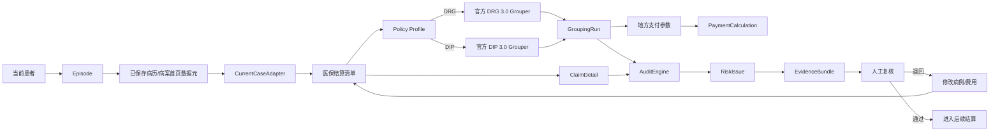

# P1 可操作业务闭环

```mermaid
flowchart LR
  A[当前患者] --> B[Episode]
  B --> C[已保存病历/病案首页数据元]
  C --> D[CurrentCaseAdapter]
  D --> E[医保结算清单]
  E --> F[Policy Profile]
  F -->|DRG| G[官方 DRG 3.0 Grouper]
  F -->|DIP| H[官方 DIP 3.0 Grouper]
  G --> I[GroupingRun]
  H --> I
  I --> J[地方支付参数]
  J --> K[PaymentCalculation]
  E --> L[ClaimDetail]
  I --> M[AuditEngine]
  L --> M
  M --> N[RiskIssue]
  N --> O[EvidenceBundle]
  O --> P[人工复核]
  P -->|退回| Q[修改病例/费用]
  Q --> E
  P -->|通过| R[进入后续结算]
```

正式分组和审核均保存患者级版本。任何病例/费用修改都会使旧正式分组过期，防止拿旧分组结果审核新清单。
